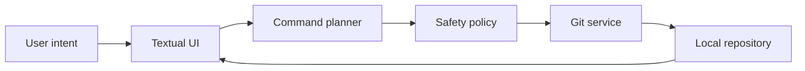

<p align="center">
  
</p>

<p align="center">
  <strong>A visual, guided and safety-first Git assistant for the terminal.</strong>
</p>

<p align="center">
  <a href="https://github.com/robycinix/git_command_center/actions/workflows/ci.yml"></a>
  
  
  <a href="https://github.com/robycinix/git_command_center/releases"></a>
  <a href="LICENSE"></a>
  
</p>

Git Command Center (GCC) turns Git from a command-memory exercise into a clear,
inspectable workflow. It shows what is happening, explains what each command
will do, highlights risk, and keeps the exact Git command visible at every step.

> [!IMPORTANT]
> GCC is currently an alpha release. The local Git workflows are functional;
> hosted-provider writes, AI calls and the visual conflict editor remain planned.

## Why GCC?

Most Git tools optimize for speed after you already understand Git. GCC also
optimizes for understanding:

- **See the repository** - branch, remotes, worktree, upstream divergence and
  latest commit in one dashboard.
- **Learn while working** - every command includes syntax, use cases, failure
  modes, consequences, risk and rollback guidance.
- **Ask for an outcome** - choose "save my work", "download updates" or
  "create a branch" and inspect the generated plan.
- **Keep control** - commands are passed as argument lists, never evaluated as
  arbitrary shell input.
- **Practice safely** - create disposable local repositories for exercises and
  experiments.

## Highlights

| Area | What it provides |
| --- | --- |
| Dashboard | Collapsible repository context, sync state, file counts and latest commit |
| Command explorer | Live search, category filters, risk filters and educational reference |
| Guided wizard | Intent-based plans with exact commands and rollback guidance |
| History | Decorated, readable commit graph across branches and tags |
| Branches | Local/remote visibility, tracking state, create, switch and guarded delete |
| Diff & recovery | Unified diff viewer plus a chronological reflog timeline |
| Learning | Lessons plus disposable sandboxes with open and confirmed delete controls |
| Safety | Risk classification, explicit confirmation and typed confirmation for critical actions |
| Languages | Persistent automatic or manual selection across six interface languages |

<p align="center">
  
</p>

## Quick Start

Python 3.13 or newer is required.

```bash
git clone https://github.com/robycinix/git_command_center.git
cd git_command_center
python -m pip install -e .
python -m git_command_center
```

Make the shorter command available from every terminal directory:

```bash
python -m git_command_center --setup-path
```

You can perform the same setup from **Settings > Terminal command > Enable the
gcc-tui command**.

Open a new terminal after the command completes, then launch GCC from anywhere:

```bash
gcc-tui
```

This does not create an environment variable named `GCC`. It adds the directory
containing the `gcc-tui` launcher to the existing user `PATH`. The `gcc-tui`
name is intentional because `gcc` commonly identifies the GNU C compiler.

The setup is idempotent: running it again reports that GCC is already present
instead of adding a duplicate `PATH` entry. On Unix-like systems GCC updates the
shell profile; on Windows it updates the current user's environment variables.

## Release Packages

Each [GitHub release](https://github.com/robycinix/git_command_center/releases)
contains a Python wheel, source archive, Windows executable, Linux executable,
macOS executable and SHA-256 checksums.

The GitHub Container Registry package can run against the repository in the
current directory:

```bash
docker run --rm -it -v "$PWD:/workspace" ghcr.io/robycinix/git_command_center:latest
```

Open a specific repository:

```bash
python -m git_command_center /path/to/repository
```

The package also installs the shorter `gcc-tui` and `git-command-center`
commands. If Windows reports that they are not recognized, the Python user
scripts directory is not in `PATH`; `python -m git_command_center` works without
changing `PATH`.

Install in an isolated environment with `pipx`:

```bash
pipx install .
git-command-center /path/to/repository
```

## Safety Model

Every executable operation is represented by a typed `CommandPlan`. GCC shows
the exact commands before execution and applies these invariants:

1. shell operators and control characters are rejected;
2. subprocesses run with argument lists and `shell=False`;
3. high-risk actions require explicit confirmation;
4. critical actions additionally require typing `CONFERMO`;
5. a multi-command plan stops after its first failure;
6. AI and GitHub provider boundaries perform no network activity by default.

## Architecture



The codebase separates domain models, repository access, application services,
provider interfaces, configuration and presentation. Repository reads and Git
operations run in Textual workers so the interface remains responsive.

Read the full [architecture](docs/architecture.md) and
[roadmap](docs/roadmap.md).

## Development

```bash
python -m pip install -e ".[dev]"
python -m ruff check .
python -m mypy src
python -m pytest
```

Build a wheel and a native executable for the current operating system:

```bash
python -m pip wheel . --no-deps --wheel-dir dist
python -m PyInstaller --clean --noconfirm git-command-center.spec
```

PyInstaller is not a cross-compiler. Windows, Linux and macOS executables must
be built on their respective operating systems.

## Configuration

GCC creates a validated YAML configuration file on first run under the platform
configuration directory. Available themes include Dark, Light, Dracula, Nord
and Gruvbox; refresh, quit and help shortcuts can be customized.

**Automatic (system)** is the default. GCC uses the operating-system language
when it is supported and falls back to English otherwise. Open the **Settings**
tab to choose and persist English, German, Spanish, French, Portuguese or
Italian; the saved choice is reused on every subsequent launch.

Use `--language` for a temporary override without changing the saved preference:

```bash
python -m git_command_center --language it
python -m git_command_center --language de /path/to/repository
```

## Contributing

Contributions that improve clarity, safety or teaching value are welcome. Read
[CONTRIBUTING.md](CONTRIBUTING.md) before opening a pull request. Security issues
should follow [SECURITY.md](SECURITY.md).

## License

Released under the [MIT License](LICENSE).
