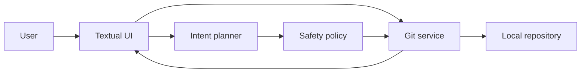

# Architecture

Git Command Center uses a small layered architecture so that the terminal UI is
not coupled to Git command parsing or future hosted services.

## Packages

- `core/`: Pydantic domain models and the command safety policy.
- `git/`: read and write access to a local repository through GitPython and
  argument-list subprocess calls.
- `services/`: command catalog, intent planner, sandbox and external-service
  boundaries.
- `ui/`: Textual application, views and interaction orchestration.
- `ai/`: provider protocol and a local disabled provider. No network call is
  made by the current release.
- `config/`: validated YAML settings and platform-specific config paths.
- `data/`: packaged educational command records.
- `themes/` and `widgets/`: presentation resources and future reusable widgets.

## Data flow

Repository refreshes, diff reads, sandbox creation and command execution run in
Textual workers. Widget mutations are marshalled back to the UI thread.

## Safety invariants

1. Every write is represented by a `CommandPlan` with risk and rollback text.
2. The UI renders exact commands before execution.
3. Arguments are passed as lists with `shell=False`; shell operators and control
   characters are rejected.
4. High-risk plans require confirmation. Critical plans additionally require
   typing `CONFERMO`.
5. Execution stops after the first failed command.
6. The initial GitHub and AI boundaries perform no network activity.

## Large repositories

The TUI never loads complete file contents for the dashboard and caps rendered
history through `history_limit`. Work occurs outside the UI thread. Future
iterations should replace full untracked-file enumeration with Git's filesystem
monitor where available and virtualize very large status tables.
